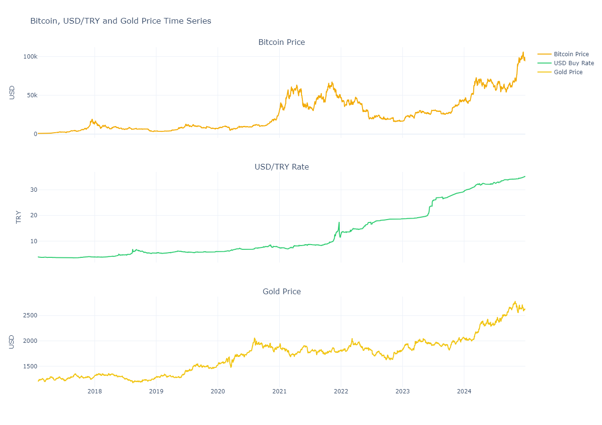
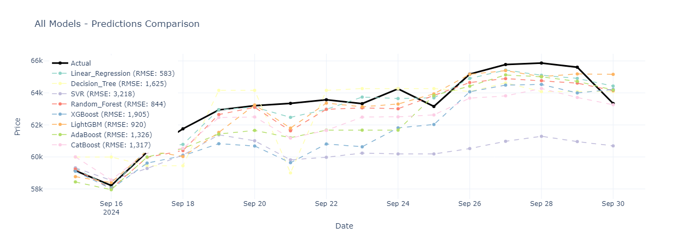
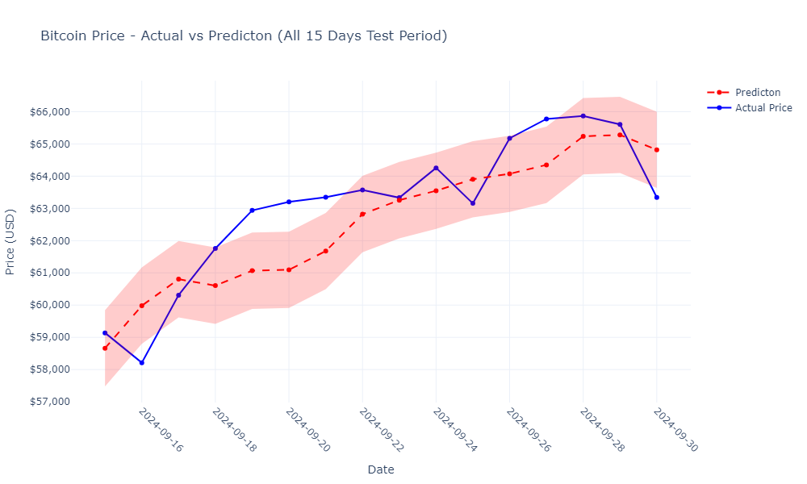

# Bitcoin Price Prediction

   

## About the Project

This project was developed as part of the TÜBİTAK 2209 - A Research Project Support Program for Undergraduate Students. It is important to note that this research was conducted for academic purposes only and not for trading or investment advice.

This project utilizes various machine learning and deep learning models to predict Bitcoin prices. The project combines Bitcoin price data with other financial data such as USD and gold prices to forecast future Bitcoin prices. The main goal is to explore and evaluate different prediction methodologies in the context of cryptocurrency price forecasting.

### Objectives

- Predict Bitcoin price movements
- Compare the performance of different machine learning and deep learning models
- Identify the best approaches for improving prediction accuracy in financial time series data

## Dataset

Datasets used in the project:

- **Bitcoin Historical Data**: Historical price data of Bitcoin
  - Source: [Investing.com Bitcoin Historical Data](https://www.investing.com/crypto/bitcoin/historical-data)
  - Date Range: January 29, 2017 to December 29, 2024
- **USD/TRY**: US Dollar/Turkish Lira exchange rate data
  - Source: [Central Bank of the Republic of Turkey (CBRT) - EVDS](https://evds2.tcmb.gov.tr/index.php?)
  - Date Range: January 01, 2017 to December 30, 2024
- **XAU/USD**: Gold price data
  - Source: [Investing.com Gold Historical Data](https://tr.investing.com/currencies/xau-usd-historical-data)
  - Date Range: January 02, 2017 to December 27, 2024

These datasets are merged using proper data alignment and imputation techniques to prevent data leakage while capturing correlations in financial markets. Missing values are handled with appropriate methods that maintain temporal integrity, ensuring that future information is not inadvertently used in training models for past predictions.



### Prediction Period and Feature Selection

For the prediction models, we focused on the following time period:
- **Training Period**: September 01, 2023 to September 14, 2024
- **Testing Period**: September 15, 2024 to September 30, 2024
- **Lookback Period**: 30 days (for time series features)

While numerous features were initially generated from the raw data, the final set of features was selected after rigorous statistical testing to address multicollinearity issues and optimize model performance. The selected features include:

- Date
- Price (target variable)
- High (daily high price)
- usd_buy (USD/TRY exchange rate)
- gold_Price (XAU/USD price)
- RSI (Relative Strength Index)
- MA_7 (7-day Moving Average)
- BTC_Gold_Ratio (Bitcoin to Gold price ratio)
- BTC_USD_Ratio (Bitcoin to USD price ratio)

## Modelling

The following models were used in the project:

### Classical Machine Learning Models
- Linear Regression
- Decision Tree
- Random Forest
- AdaBoost
- XGBoost
- LightGBM
- CatBoost
- Support Vector Regression (SVR)

### Deep Learning Models
- Bidirectional LSTM (Long Short-Term Memory) networks

### AutoML Solutions
- AutoGluon library for automatic model selection and hyperparameter optimization

## Results

Model performance comparison was conducted using the following metrics:
- RMSE (Root Mean Squared Error)
- MAE (Mean Absolute Error)
- R² (Determination Coefficient)
- MAPE (Mean Absolute Percentage Error)

### Model Performance Visualizations

| Model             | Scaled RMSE | RMSE  | MAE   | MAPE  | R²      | CV RMSE | CV MAE | CV MAPE |
|-------------------|-------------|-------|-------|-------|---------|---------|--------|---------|
| Linear_Regression | 0.039803    | 583   | 485   | 0.76% | 0.9287  | 1,006   | 698    | 1.23%   |
| Decision_Tree     | 0.110921    | 1,625 | 1,329 | 2.11% | 0.4466  | 5,136   | 3,827  | 7.05%   |
| SVR               | 0.219678    | 3,218 | 2,844 | 4.43% | -1.1706 | 7,422   | 6,131  | 11.08%  |
| Random_Forest     | 0.057608    | 844   | 699   | 1.10% | 0.8507  | 4,337   | 3,280  | 6.30%   |
| XGBoost           | 0.130051    | 1,905 | 1,638 | 2.58% | 0.2393  | 4,127   | 3,091  | 5.92%   |
| LightGBM          | 0.062776    | 920   | 688   | 1.09% | 0.8227  | 4,957   | 3,840  | 7.34%   |
| AdaBoost          | 0.090499    | 1,326 | 1,157 | 1.82% | 0.6316  | 4,450   | 3,397  | 6.50%   |
| CatBoost          | 0.089907    | 1,317 | 1,116 | 1.75% | 0.6364  | 5,308   | 4,185  | 7.92%   |

It's important to note that all classical machine learning models were evaluated using their default parameters without any hyperparameter optimization. This approach provides a baseline comparison of the models' inherent capabilities for this specific prediction task. Performance could potentially be improved through proper hyperparameter tuning.



Based on the performance metrics in the table above, the top three performing classical machine learning models are:

1. **Linear Regression**: Shows the best performance with the lowest RMSE (583), MAE (485), and MAPE (0.76%), as well as the highest R² value (0.9287). However, it's important to note that despite these impressive metrics, Linear Regression models can be less reliable in financial time series prediction due to multicollinearity issues among features. The high performance might be misleading as the model could be overfitting to the training data, which is also suggested by the higher CV RMSE compared to the test RMSE.

2. **Random Forest**: Demonstrates good performance with an RMSE of 844, MAE of 699, and a strong R² value of 0.8507. This ensemble method is more robust against multicollinearity and can capture non-linear relationships in the data.

3. **LightGBM**: Performs well with an RMSE of 920, MAE of 688, and an R² value of 0.8227. This gradient boosting framework is efficient and can handle complex relationships in financial data.

### LSTM Model Performance

The LSTM model was trained with a bidirectional architecture to capture temporal patterns in both directions. The model achieved the following performance metrics:

**Training Metrics:**
- Training Loss: 0.2423
- Training MAE: 0.1822
- Validation Loss: 0.2222
- Validation MAE: 0.1649

**Test Metrics:**
- Scaled RMSE: 0.0712
- RMSE: 1,204.95
- MAE: 1,049.35
- R² Score: 0.6956
- MAPE: 1.67%

While the LSTM model shows higher RMSE and MAE values compared to some classical models, it demonstrates superior ability to capture the temporal dynamics of Bitcoin prices, especially for longer prediction horizons. The model's strength lies in its capacity to learn complex patterns over time sequences, making it particularly valuable for financial time series forecasting.



### AutoGluon Results

The AutoGluon framework was used to automatically select and optimize models for the prediction task. For detailed results and visualizations of the AutoGluon performance, please refer to the visualization files in the `src/visualization` directory. The AutoML approach provides an interesting comparison to both the classical models and the deep learning approach, as it automatically handles feature engineering, model selection, and hyperparameter tuning.

### Best Performing Models

For the specified prediction period (September 2023 - September 2024), the following models showed the best performance:

1. **LSTM**: Best for capturing temporal dynamics and time series patterns
2. **Random Forest**: Strong overall performance with good robustness
3. **Linear Regression**: Highest numerical accuracy but caution needed due to multicollinearity

It's important to note that model performance is highly dependent on the specific time period used for training and testing. Different results may be obtained with different date ranges, market conditions, or feature selections.


## Future Work

- Incorporation of sentiment analysis and social media data into the model
- Experimentation with Transformer-based models
- Development of models for longer-term predictions
- Creation of a real-time prediction system with live data streaming

## Contact

Please get in touch if you have any questions about the project.

<div style="display: flex; gap: 10px;">
  <a href="https://github.com/enesmanan">
    
  </a>
  <a href="https://www.linkedin.com/in/enesfehmimanan/">
    
  </a>
  <a href="https://x.com/enesfehmimanan">
    
  </a>
</div>

## Project Structure

```
bitcoin-price-prediction/
├── data/                          
│   ├── Bitcoin Historical Data.csv # Bitcoin historical data
│   ├── dolar.csv                   # USD/TRY data
│   ├── XAU_USD Geçmiş Verileri.csv # Gold price data
│   └── merged_data.csv             # Merged dataset
├── src/                            
│   ├── pipeline.ipynb              # Main pipeline notebook
│   │
│   ├── preprocessing/              
│   │   └── data_preprocessor.py    # Data preprocessing classes
│   ├── model/                      
│   │   ├── models.py               # Classical ML models
│   │   ├── lstm_model.py           # LSTM deep learning model
│   │   └── automl_autogluon.py     # AutoML implementation
│   └── visualization/              
│       ├── data_eda.py             # Exploratory data analysis
│       └── model_visualizations.py # Model results visualization
└── README.md   
```
